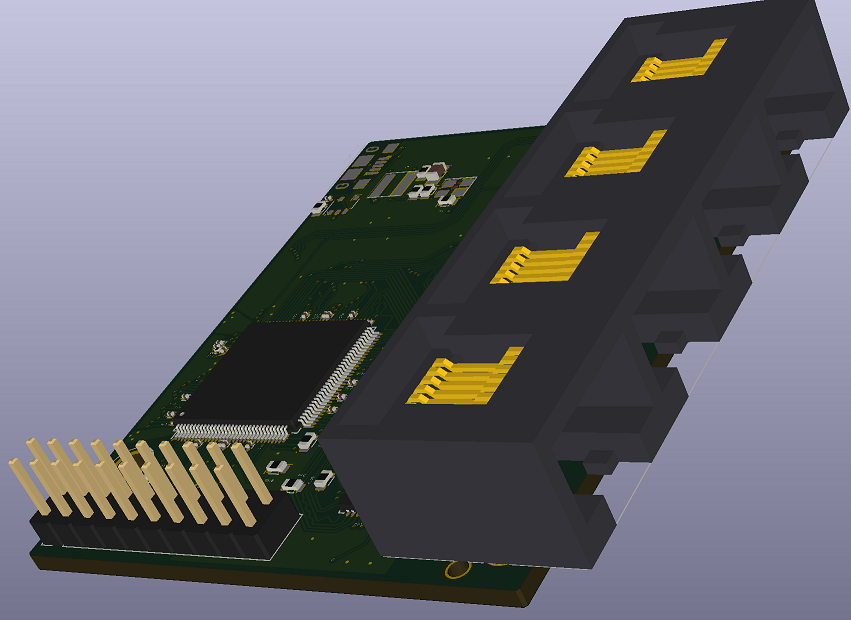

# IsoSwitch.201802
IsoSwitch.201802 is a point-in-time release of the GPLv3-licensed source code and HW design for the CrowdSwitch product.
Please do not use the CrowdSwitch name for anything networking related. 
The CrowdSwitch name is claimed by Travis and Lindsey Martin.

# Status
This code is under active development; it's only being released to demonstrate our commitment to free/libre software. 
It's not ready for use as there are major missing features and missing tests. Please consider not judging the code quality until we declare a stable release :-)

This code is not yet useful as a switch: It only runs under an XMOS simulator.

# CrowdSwitch
<table>
 <tr>
  <td>
   
  </td>
  <td>
   
  </td>
 </tr>
</table>
CrowdSwitch is an open hardware product built using the [IsoGrid](http://www.isogrid.org) protocol. When wired together they form a streaming, scalable, mesh network.  
The full hardware design files (i.e. mechanical drawings, schematics, bill of materials, PCB layout data) are included in this release.

Our initial plan is to give low cost (or free) CrowdSwitches to low income residents of extremely 
high-density urban communities. 
The best funding model still isn't clear, but we intend to build it within a 501(c)(3) organization 
to make our altruistic motives super clear.
- 4-port auto-configuring switch
  - 3x RJ45 ~100 Mbps full-duplex [ethernet PHY](https://en.wikipedia.org/wiki/Ethernet_physical_layer#Fast_Ethernet) with 1ms worst-case switching latency
  - 1x RJ45 ~25 Mbps full-duplex Ethernet connection to an external controller PC or [SoC](https://en.wikipedia.org/wiki/System_on_a_chip) with 8ms worst-case switching latency 
- The core of the switch is an [xCORE-200 XL216-512-TQ128](http://www.xmos.com/download/private/xCORE-200-XL-Product-Brief%281.3%29.pdf)
- Powered by Micro USB
- Target BOM cost is ~$15.
- External controller PC/SoC (~$9) with ~512MB of RAM, ~16GB of flash, and able to create a wireless hotspot

The Wi-Fi on the PC/SoC will be able to work in one of two modes:
 1. Providing Internet access to a user
 2. Connecting to a regular Wi-Fi Internet access point

The IsoGrid formed by the interconnected mesh of CrowdSwitches provides a redundant multi-path backbone
to connect nodes operating in Mode (1) to nodes operating in Mode (2).

# Declaration & Dedication
    Copyright (2017-2018) Travis J Martin
    Copyright (2017) Lindsey A Martin
    
    IsoSwitch.201802 is free software: you can redistribute it and/or modify
    it under the terms of the GNU General Public License version 3 as published
    by the Free Software Foundation.

    IsoSwitch.201802 is distributed in the hope that it will be useful,
    but WITHOUT ANY WARRANTY; without even the implied warranty of
    MERCHANTABILITY or FITNESS FOR A PARTICULAR PURPOSE.  See the
    GNU General Public License version 3 for more details.

    You should have received a copy of the GNU General Public License version 3
    along with IsoSwitch.201802.  If not, see <http://www.gnu.org/licenses/>.

    A) We, the undersigned contributors to IsoSwitch.201802, declare that our 
       contribution was created by us as individuals, on our own time, entirely for 
       altruistic reasons, with the expectation and desire that the Copyright for our 
       contribution would expire in the year 2038 and enter the public domain.
    B) At the time when you first read this declaration, you are hereby granted a license
       to use IsoSwitch.201802 under the terms of the GNU General Public License, v3.
    C) Additionally, for all uses of IsoSwitch.201802 after Jan 1st 2038, we hereby waive 
       all copyright and related or neighboring rights together with all associated claims
       and causes of action with respect to this work to the extent possible under law.
    D) We have read and understand the terms and intended legal effect of CC0, and hereby 
       voluntarily elect to apply it to IsoSwitch.201802 for all uses or copies that occur 
       after Jan 1st 2038.
    E) To the extent that IsoSwitch.201802 embodies any of our patentable inventions, we 
       hearby grant you a worldwide, royalty-free, non-exclusive, perpetual license to 
       those inventions.

|    Signature     |  Declarations   |                                                     Acknowledgments                                                                                      |
|:----------------:|:---------------:|:--------------------------------------------------------------------------------------------------------------------------------------------------------:|
| Travis J Martin  |    A,B,C,D,E    | My loving wife, Lindsey Ann Irwin Martin, for her incredible support on our journey!                                   |
| Lindsey A Martin |    A,B,C,D,E    | Travis' spirit of thinking big, desire to help humanity, and much hard work that has made this project a reality.            |

# Contribution Policy
Join our [Slack team](https://crowdswitch.slack.com) and ask us for ways you can help. 
Those of us working on the CrowdSwitch Project are only trying to do good; contributions that don't 
further the goals of the CrowdSwitch Project will be rejected. Non-trivial contributions should include 
the CrowdSwitch copyright/license declaration signed by the contributor. We'll consider pull requests 
without the declaration if the contribution is small enough to obviously avoid copyright/patent concerns. 
If you don't like the declaration, let us know why; perhaps we can work something out. Otherwise, feel 
free to fork it under the terms of the GPLv3 license.

# Details
| Component         | Description                                                                         |
|-------------------|-------------------------------------------------------------------------------------|
| HMLM(Test)        | Prototype HashMatchLogMap route mapping algorithm                                   |
| HW                | Schematic, PCB Layout in KiCad format. BoM in xlsx format                           |
| HW\Datasheets     | Archived datasheets for select components                                           |
| HW\SnapEda        | Symbols and Footprints for some components, freely licensed by SnapEda              |
| IsoSwitch         | C# implementation of an IsoGrid switch controller (bridging C# interfaces and ETH)  |
| XMOS\             |                                                                                     |
| XMOS\EthPluginX   | Simulation plugin for Ethernet PHY in XMOS\IsoSwitch using named-pipes              |
| XMOS\IsoSwitch    | 16-core XMOS Firmware implementing the High-performance kernel of an IsoGrid switch |

# Build and Test
### Common Instructions for Windows:
* Install Visual Studio Community 2017 (C/C++) from [here](https://www.visualstudio.com/downloads/)
* Install XMOS's [xTIMEcomposer Studio 14.3.2](https://www.xmos.com/published/xtimecomposer-community_14-microsoft-installer?ver=latest)
* Open xTIMEcomposer and open the Workspace at \XMOS
* Build the \XMOS\IsoSwitch project in xTIMEcomposer
* Open the CrowdSwitch.sln in Visual Studio
* Rebuild the solution

### Simulator-Only Test
* Run IsoSwitchTest.UT1.SimpleStream from Test Explorer
  * It runs for 7-9 minutes

### XCore-200 SliceKIT (proof-of-concept test)
* You'll need an [XCORE-200 SliceKIT](https://www.xmos.com/support/boards?product=35833)
* You'll need 3x [Ethernet | XA-SK-E100 SliceCARDs](https://www.xmos.com/support/boards?product=15830)
* Plug the Ethernet SliceCARDs into Tile-1-Star, Tile-1-Triangle, and Tile-0-Triangle
* Connect a crossover Ethernet cable between Tile-1-Triangle and Tile-0-Triangle
* Connect an Ethernet cable between Tile-1-Star and your test PC
* Build and install the ndisprot driver fork at: https://github.com/IsoGrid/NdisProtocol
* Enable the IsoSwitch NDIS Protocol driver only on the one Ethernet port on your PC
* run "net start ndisprot" from an elevated command prompt
* Run IsoSwitchTest.UT1.SliceKitBringupTest from Test Explorer in the CrowdSwitch Visual Studio solution
  * It runs for 30 seconds

# LICENSES
GPLv3: <http://www.gnu.org/licenses/>
* IsoSwitch.201802

Apache 2.0: http://www.apache.org/licenses/LICENSE-2.0
* DamienG.Security.Cryptography
